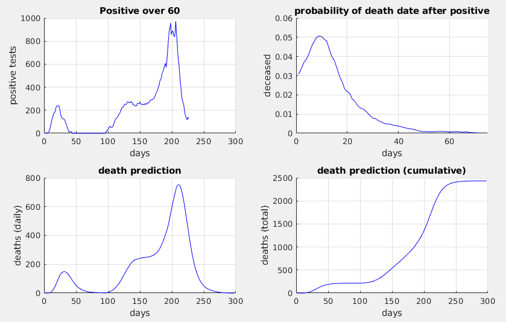
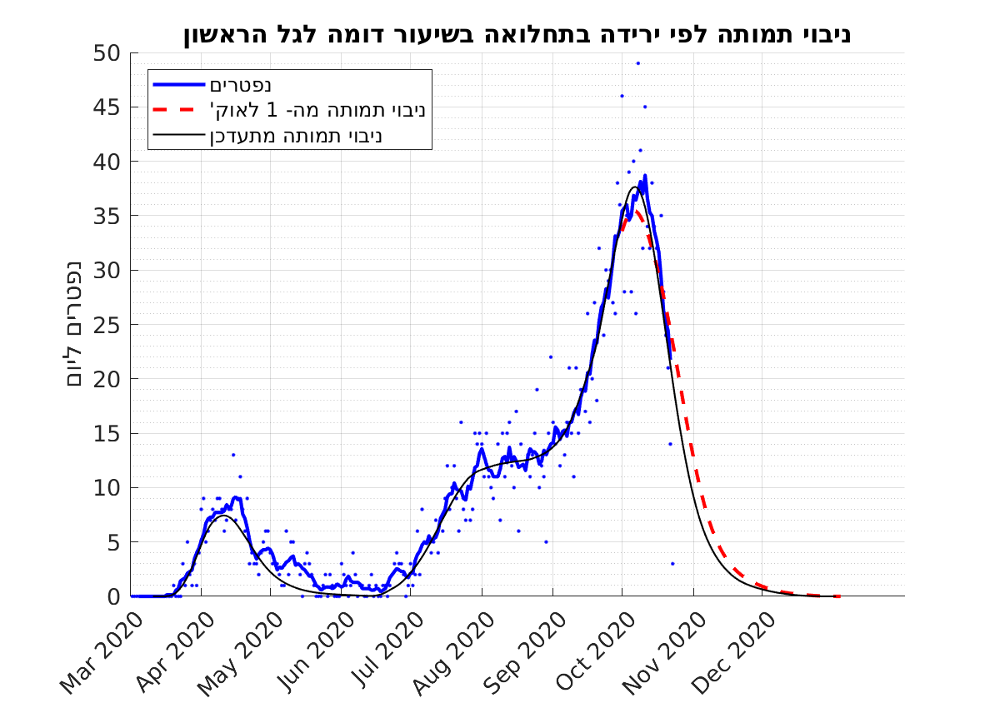

## Predict deaths by positive tests for over 60y old
The tests by data age is downloaded from [here](https://data.gov.il/dataset/covid-19/resource/d337959a-020a-4ed3-84f7-fca182292308). Since this is heavy, millions of lines, I save daily summaries in  [tests.csv](https://github.com/yuval-harpaz/covid-19-israel-matlab/blob/master/data/Israel/tests.csv). The dashboard data for the deceased is shorter, but has no GUI to download it. I get it with curl and put it here [dashboard_timeseries.csv](https://github.com/yuval-harpaz/covid-19-israel-matlab/blob/master/data/Israel/dashboard_timeseries.csv). I also use a probability vector, which is a normalized histogram for the days it took from recieving a positive result to death. It is saved in [positive_to_death.txt](https://github.com/yuval-harpaz/covid-19-israel-matlab/blob/master/data/Israel/positive_to_death.txt), and can be computed from [this resource](https://data.gov.il/dataset/covid-19/resource/a2b2fceb-3334-44eb-b7b5-9327a573ea2c). 
So, you sum female and male test columns pos_m_60 + pos_f_60, you smooth the vector with a 3day back to 3day (1 week) forward moving average window (top left plot). You convolute this with the date of death probability vector (top right), and divide the result by 10 (bottom left). Why 10? the probability of death is normalized to have sum == 1 and does not reflect actual probability of death. You can adjust this parameter to get smaller error. To pull the tables and compute prediction with python you can use [predict_pos60.py](https://github.com/yuval-harpaz/covid-19-israel-matlab/blob/master/code/predict_pos60.py). Make it better and let us know.

## Oct-1 prediction to present
In red there's a prediction made on Oct 1st, It assumes a linear reduction on positive tests, similarly to the steep decent of first wave. The black line is up to date with tests results.

